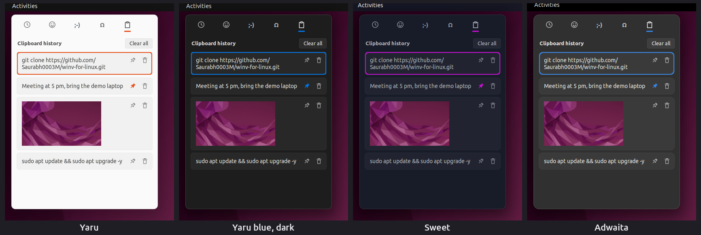
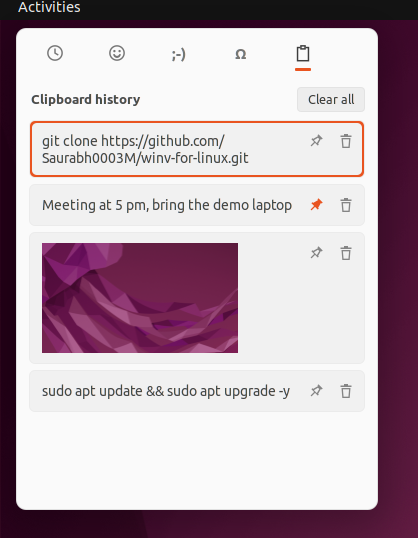
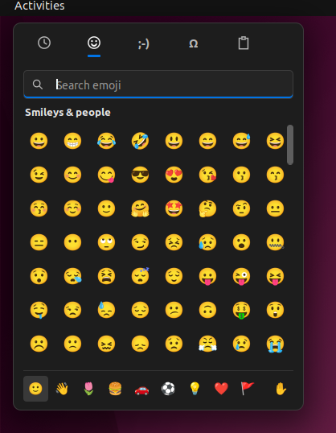
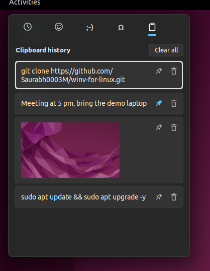
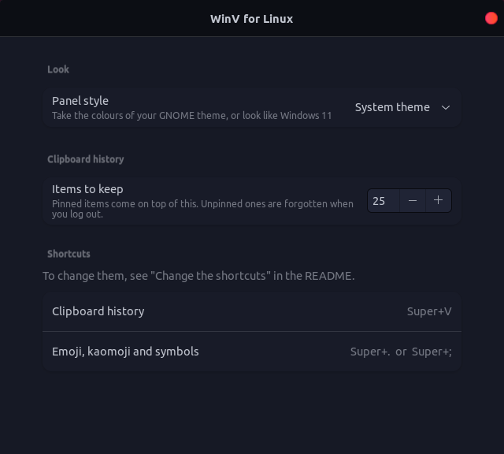

# WinV for Linux — Windows 11 style clipboard history (Win+V) for Ubuntu and GNOME

<p align="center">
  
</p>

<p align="center">
  <a href="https://github.com/Saurabh0003M/winv-for-linux/releases"></a>
  
  
  <a href="LICENSE"></a>
  <a href="https://github.com/sponsors/Saurabh0003M"></a>
</p>

**WinV for Linux** brings the Windows 11 **Win+V clipboard history** and the **Win+. emoji panel** to
Ubuntu. Press **Super+V** to see everything you copied, text and images, and click an item to
paste it straight into the app you are typing in. It is a GNOME Shell extension for **Ubuntu 22.04
LTS (GNOME 42)**, works on **Wayland and X11**, and takes its colours from your GNOME theme.

## Features

- **Clipboard history on Super+V** — text and images (screenshots too), newest first, 25 items by
  default (10–100 in the settings).
- **Click or Enter pastes** into the app you were in, including terminals (GNOME Terminal, the VS
  Code terminal) and apps running under XWayland.
- **Pin** items to keep them across restarts and *Clear all*; remove single items with the bin
  button or the Delete key.
- **Private by default** — unpinned history lives in memory only and is forgotten when you log
  out; pinned items are stored readable only by you; copies from password managers (KeePassXC)
  and files copied in the file manager are left out, as on Windows. No network code.
- **Emoji picker on Super+.** (and Super+;) — 1,500+ emoji with search and skin tones, kaomoji
  ( ͡° ͜ʖ ͡°) and symbols (math, arrows, currency, Greek, …). The panel stays open so you can
  insert several.
- **Opens at your text cursor**, falling back to the mouse position.
- **Keyboard friendly** — arrow keys, Tab, Enter, Delete and Esc all work.
- **Matches your theme** — Yaru with any Ubuntu accent colour, light or dark, Adwaita and custom
  shell themes such as Sweet. Prefer the Windows look? Switch to the **Windows 11** style.

<p align="center">
  
  
  
</p>

## Install

Needs **Ubuntu 22.04 LTS** or another Linux with **GNOME Shell 42**.

```bash
git clone https://github.com/Saurabh0003M/winv-for-linux.git
cd winv-for-linux
./install.sh
```

Then **log out and back in** (GNOME on Wayland loads new extensions at login) and press
**Super+V**. WinV takes Super+V over from GNOME's notification list, which keeps Super+M
(`./install.sh --uninstall` gives it back).

Or install the zip from the [latest release](https://github.com/Saurabh0003M/winv-for-linux/releases):

```bash
gnome-extensions install --force winv-for-linux@saurabh0003m.github.io.shell-extension.zip
```

To remove it: `./install.sh --uninstall`.

## Keyboard shortcuts

| Keys | What it does |
|---|---|
| **Super+V** | clipboard history |
| **Super+.** or **Super+;** | emoji, kaomoji and symbols |
| Arrow keys, Tab | move around |
| Enter or click | paste the item / insert the emoji |
| Delete | remove the selected clipboard item |
| Esc, click outside, Super+V again | close |

## Settings

Open **Extensions → WinV for Linux → Settings** to choose the **panel style** (match the system
theme, or Windows 11) and how many **items to keep**.

<p align="center"></p>

### Change the shortcuts

```bash
gsettings --schemadir ~/.local/share/gnome-shell/extensions/winv-for-linux@saurabh0003m.github.io/schemas \
    set org.gnome.shell.extensions.winv-for-linux toggle-clipboard "['<Super><Shift>v']"
```

The emoji shortcut is `toggle-emoji`. Log out and back in after changing them.

## How it works

- Watches the clipboard through Mutter's selection API; text is kept in memory, images in
  `/run/user/<you>/winv-for-linux` (also memory), pinned items in `~/.local/share/winv-for-linux`.
- Pastes by putting the item on the clipboard (and the primary selection, for terminals) and
  pressing Shift+Insert (Ctrl+V for images) with a virtual keyboard, one key at a time so IBus
  keeps the modifier.
- Emoji go through the input method in native Wayland apps, so your clipboard is not touched;
  X11 apps get them through the clipboard, which is put back straight after.
- Theme colours: reads the menu background, text colour and accent colour of the active shell
  theme through GNOME Shell's own style engine and generates a small stylesheet from them.

## FAQ

**Does it work on Ubuntu 24.04 or newer (GNOME 45+)?**
Not yet. GNOME 45 changed how extensions are written; a port is planned and help is welcome.

**Why is it not on extensions.gnome.org?**
The code was written with an AI assistant (see below), and extensions.gnome.org does not accept
AI-generated extensions. So it is published here, open source, for anyone to read and check.

**Is my clipboard sent anywhere?**
No. There is no network code; everything stays on your computer.

**Super+V does nothing.**
Log out and back in after installing. If another clipboard manager (for example Clipboard
Indicator) also uses Super+V, disable one of them.

**Found a bug?** [Open an issue](https://github.com/Saurabh0003M/winv-for-linux/issues) with your
Ubuntu version, theme, and the output of
`journalctl -b -o cat /usr/bin/gnome-shell | grep -i winv`.

## ❤️ Support

I am a student in India and I build and maintain this in my free time. If WinV saves you time
every day, please consider a small donation. Even **$1 (about ₹85) pays for a meal** for me here.

- [Sponsor on GitHub](https://github.com/sponsors/Saurabh0003M)

Can't donate? Please **⭐ star the repo**. It helps other Ubuntu users find it, and it costs
nothing.

## How this was made

WinV for Linux was designed and tested by **Saurabh Tomke** and written with **Claude**,
Anthropic's AI assistant. Every feature was tried on a real Ubuntu 22.04 desktop and in isolated
GNOME Shell test sessions before release.

## License

[GPL-2.0-or-later](LICENSE), the same licence as GNOME Shell.
